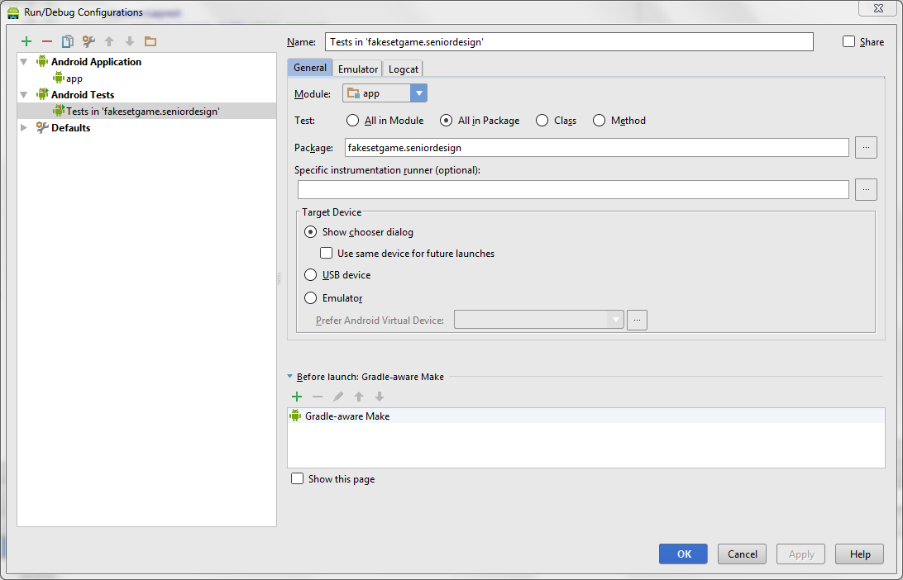

SeniorDesign
============

CS 4911 Project: Modified version of Set Game with multiplayer, leaderboard support

The deliverable is an Android app running on Android 4.0.3 (API15)

## Steps for Setting up a Development Environment
1. We use [Android Studio](https://developer.android.com/sdk/installing/studio.html) as the IDE for our project. Android Studio is based on intelliJ, but you may have trouble trying to set up intelliJ to work well for Android development. Please install Android Studio, or don't complain that this doesn't go smoothly.
  * Android Studio requires a [Java SDK](http://www.oracle.com/technetwork/java/javase/downloads/jdk8-downloads-2133151.html)
2. Use your favorite Git tools to clone this repository to your development computer.
3. Open the project in Android Studio
	1. Open Android Studio
	2. From the "Quick Start" menu, select "Open Project..."
	3. Select the root of the cloned repository
4. Use the SDK Manager (Tools/Android/SDK Manager) from Android Studio to install Android 4.0.3 SDK (API15) and the tools necessary to test the app (either drivers for your device or emulation tools).

## Project Structure
In Android Studio, pressing Ctrl+1 will open the Project view and allow you to browse the source for the app. Navigate to ./app/src.

### Unit tests
Unit tests can be found under src in the androidTest package.

To run the unit tests, you'll need to create a Run/Debug configuration for unit tests. This configuration will run all unit tests at once.

### App code
The code for the app can be found in src/main. You're going to have to figure it out. It's not very big.